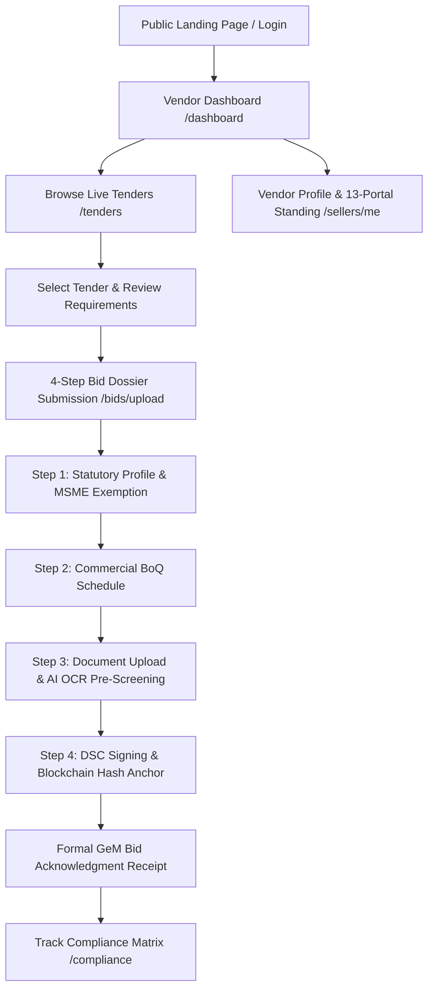
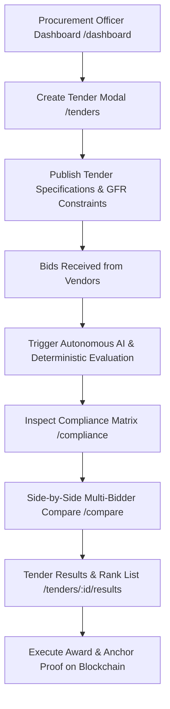
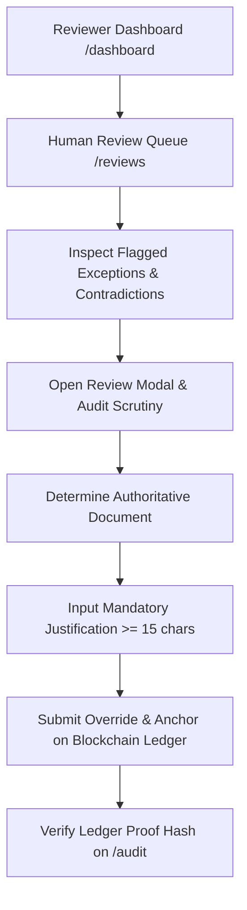

# Government e-Marketplace (GeM) AI Compliance Platform
# Comprehensive User Flow & Role Analysis Guide

---

## 1. Executive Summary & Platform Architecture

The **SIH26100 GeM AI Compliance & Decision Support Platform** is an enterprise public procurement governance suite engineered to enforce strict compliance with **General Financial Rules (GFR 2017 & 2024 revisions)**.

The platform architecture unites five specialized layers:
1. **Frontend Experience**: React 18, TypeScript, Tailwind CSS, Vite with single-page app (SPA) routing and Vercel-ready serverless bridge.
2. **Backend API Core**: Spring Boot 3 / Java 17 enterprise REST engine with Flyway schema versioning and RBAC enforcement.
3. **AI Cognitive Engine**: FastAPI Python service implementing deterministic mathematical threshold vetting, hybrid RAG document citation, and prompt-injection defense.
4. **Blockchain Audit Anchor**: Ethereum Virtual Machine (EVM) Consortium smart contract (`ComplianceAuditLedger.sol`) ensuring tamper-evident provenance.
5. **Government Portal Gateway**: 13-portal statutory verification simulator (GSTN, MCA21, EPFO, ESIC, Udyam MSME, DPIIT, CPPP debarment, DigiLocker).

---

## 2. Platform Web Addresses & Service Registry

All endpoints are operational and configured for cloud hosting:

```text
┌──────────────────────────────┬─────────────────────────────────────┬────────────────────────────────────┐
│ Component                    │ Local Web Address                   │ Production / Vercel Web Address    │
├──────────────────────────────┼─────────────────────────────────────┼────────────────────────────────────┤
│ GeM Public Portal (Frontend) │ http://localhost:3000               │ https://code-smith.vercel.app      │
│ Spring Boot REST API Core    │ http://localhost:8080/api/v1        │ /api/v1 (Vercel Serverless Gateway)│
│ AI Intelligence Engine       │ http://localhost:8000               │ Deferred (Local-first for now)     │
│ Blockchain EVM Consortium    │ http://localhost:8545 (Chain 31337) │ Consortium RPC / Polygon Amoy      │
└──────────────────────────────┴─────────────────────────────────────┴────────────────────────────────────┘
```

---

## 3. Complete Role-by-Role User Flow Analysis

---

### Role 1: Bidder / Vendor (`BIDDER_VENDOR`)
*Primary Persona: Apex Pumps & Motors Pvt Ltd (`bidder.demo@gembid.local` / `bidder.apex@gmail.com`)*

#### Objectives
Participate in live public tenders, inspect qualification criteria, submit digitally signed technical/commercial bid dossiers, track AI pre-screening, and maintain statutory portal standing.

#### End-to-End User Journey


#### Detailed Screens & Features

1. **Vendor Self-Service Dashboard (`/dashboard`)**:
   - **Header**: High-contrast government branding with direct action: *"Submit Bid Dossier"*.
   - **KPI Metrics**:
     - *Open Tenders*: Number of active requisitions open for bidding.
     - *My Submitted Bids*: Real-time status (`UNDER_EVALUATION`, `COMPLIANT`, `AWARDED`).
     - *Debarment Status*: Verified `CLEAR` across Ministry of Finance and CPPP registers.
     - *MSME / Udyam Rating*: `ACTIVE` (Class-I Local Supplier, >60% local content).
   - **Active Procurement Tenders Widget**: Cards for tenders accepting bids with estimated values, closing dates, and direct *"Submit Bid"* triggers.
   - **Certificate Expiry Self-Check**: Real-time alerts for Udyam, BIS License, and GST annual filings.
   - **Pre-Screening Results**: Summary of rule evaluations on previously uploaded bids.

2. **Live Tenders & Bidding Opportunities (`/tenders`)**:
   - **Search & Filtering**: Search by tender reference number (`GEM/2026/B/90125`), ministry, or keywords.
   - **Category Filters**: Filter by *Industrial Equipment*, *IT & Data Systems*, *Medical Equipment*.
   - **Status Tabs**: *All Tenders*, *Accepting Bids*, *Awarded Contracts*, *Under Evaluation*, *Closed*.
   - **Tender Cards**:
     - Est. Value in Crores (`₹5.00 Cr`).
     - EMD Exemption Status (`MSME Exempt per GFR Rule 170`).
     - Closing Countdown (`30-Sep-2026, 17:00 IST`).
     - **"Participate & Submit Bid" Action**: Prominent button pre-filling the tender ID in the submission wizard for open tenders.
     - **"View Award Standings & Proof" Action**: Dedicated gold badge and award banner on awarded contracts (`GEM/2026/B/90124`) linking directly to blockchain results.
   - **Clause Transparency**: Expandable table listing all mandatory GFR clauses, thresholds, units, and verification methods.

3. **4-Step Bid Dossier Submission Wizard & 1-Click Fast Submit (`/bids/upload`)**:
   - **Header Fast Submit Trigger**: Persistent, glowing **"⚡ 1-Click Fast Submit & Digital Seal"** button in the header across all steps, enabling immediate submission with auto-attached verified documents.
   - **Step 1 — Statutory & Vendor Profile**: Pre-filled from verified profile (GSTIN, PAN, Udyam number, local content percentage, EMD exemption mode). Includes 1-Click Fast Submit button.
   - **Step 2 — Commercial BoQ Quote**: Interactive landed cost calculator (Quantity × Base Unit Price + GST 18% = Total Landed Cost in INR).
   - **Step 3 — Technical Dossier Upload & AI Pre-Screening**:
     - Multi-file drag-and-drop or single-click *"Load Verified Bid Pack (5 PDFs)"* (includes Technical Datasheet, CA Turnover Certificate, Balance Sheet, ISO 9001, GST certificate).
     - Always-visible action footer with bold **"Submit Formal Bid Dossier & Digital Seal (DSC)"**.
     - Seamless client-side deterministic fallback: If local AI microservice is offline, the client parsing engine extracts text, chunk counts, page counts, generates SHA-256 digests, and completes submission without error.
   - **Step 4 — Official GeM Bid Submission Acknowledgment Certificate**:
     - Official Government of India Form GeM-SUB-01 with Gold Ashoka Emblem.
     - Class-3 Digital Signature Certificate (DSC) verification serial.
     - Hardhat EVM Blockchain Transaction Hash (Chain ID 31337).
     - Direct action buttons: `[Print Receipt]`, `[My Dashboard]`, `[Blockchain Ledger]`, `[Open AI Compliance Matrix]`.

4. **Vendor Clarifications & Representation Desk (`/reviews`)**:
   - Full implementation under **GFR 2017 Rule 173(iv)**, replacing blunt 403 walls.
   - Committee inquiry tracking, statutory response deadlines, and interactive **File Formal Representation** modal with DSC seal and blockchain anchoring.

---

### Role 2: Procurement Officer (`PROCUREMENT_OFFICER`)
*Primary Persona: Sh. Rajesh Sharma (`procurement.demo@gembid.local` / `officer.sharma@gem.gov.in`)*

#### Objectives
Publish and manage tenders, execute autonomous compliance evaluation pipelines, compare competing bids, review risk scores, and record final award decisions.

#### End-to-End User Journey


#### Detailed Screens & Features

1. **Procurement Executive Dashboard (`/dashboard`)**:
   - **Tender Lifecycle Pipeline Stepper**: Interactive visual stepper tracking NIT Published -> Bids Ingested -> OCR Extraction -> Committee Review -> Financial BoQ (L1) -> Contract Awarded.
   - **Live Turnaround Acceleration Calculator**: Interactive 24/48/72 hrs baseline selector quantifying hours and rupees saved per tender (48hr baseline savings: ~47.5 hrs, ~₹2.13 Lakh saved).
   - **Published Tenders Under Management**: With direct action buttons (`Run Pipeline`, `Compare Bids`, `View Matrix`).
   - **Verified Requirements Status Breakdown**: Compliant, Partially Met, Non-Compliant, Unverified.
   - **Bidder Risk Index Highlight & Contradiction Drill-Down**.
   - **Collusion & Forgery Signals Alert**.

2. **Tender Management & Creation (`/tenders`)**:
   - **"Create Tender Notice (NIT)"**: Modal to define tender title, issuing authority, category, estimated budget, closing date, and upload PDF specifications.
   - **"Run Evaluation" Action**: One-click execution of deterministic and machine-learning rule checkers across all submitted vendor bids.

3. **Multi-Bidder Compare Matrix (`/compare`)**:
   - Side-by-side comparison between **Apex Pumps & Motors** vs. **GlobalFlow Engineers**.
   - Comparison across:
     - Turnover (₹100 Cr threshold)
     - Technical efficiency (85% requirement)
     - Production capacity (800 units/day)
     - ISO 9001 validity
     - Landed commercial price (L1 determination)

4. **Award Determinations & Standings (`/tenders/:id/results`)**:
   - Formal L1 / L2 ranking table.
   - Live **Blockchain Proof Badge** showing on-chain transaction hash for the award.

---

### Role 3: Compliance Reviewer (`COMPLIANCE_REVIEWER`)
*Primary Persona: Smt. Priya Verma (`reviewer.demo@gembid.local` / `reviewer.verma@gem.gov.in`)*

#### Objectives
Investigate exceptions, resolve document contradictions, examine multi-stage reasoning chains, and record auditable human overrides per GFR Rule 173.

#### End-to-End User Journey


#### Detailed Screens & Features

1. **Dedicated Technical Committee Dashboard (`/dashboard`)**:
   - Header: *"Technical Scrutiny & Human Review Command"* (Rule 173 GFR 2017).
   - **4 Stat Cards**: Pending Committee Scrutiny (3 In Queue), Contradictions Flagged (1 Variance), Human Overrides Justified, Reviewer AI Alignment (96.2%).
   - **Action Items Requiring Committee Human Evaluation**: Interactive items for `REQ-FIN-001` (Turnover discrepancy), `REQ-TECH-003` (Pump efficiency testbed validation), and `REQ-EXP-004` (PSU experience) with direct `[Adjudicate & Override]` and `[View Citations]` actions.
   - **Personal Confidence Calibration Monitor**: 88% High Confidence, 9% Medium, 3% Overridden with justification.
   - **Statutory Committee Guidelines** under GFR 2017 Rule 173.

2. **Human Review Queue (`/reviews`)**:
   - Filters for *Pending Scrutiny*, *Contradictions Flagged*, *Overridden*, and *Approved*.
   - Displays detected conflicts, such as **Contradiction in Pump Production Capacity** (Datasheet: 800 units/day vs. Brochure: 500 units/day).

3. **Scrutiny & Override Modal**:
   - Displays side-by-side snippets of conflicting documents with page numbers.
   - Requires the reviewer to select the authoritative document and enter a detailed statutory rationale.
   - Updates the compliance status and creates an immutable event in the audit trail.

---

### Role 4: Vigilance & Comptroller Auditor (`AUDITOR`)
*Primary Persona: CAG Audit Directorate (`auditor.demo@gembid.local` / `auditor.cag@gov.in`)*

#### Objectives
Conduct independent post-award scrutiny, inspect blockchain audit provenance, verify zero tampering, and export executive compliance audit memorandums.

#### Detailed Screens & Features

1. **Dedicated Integrity & Audit Dashboard (`/dashboard`)**:
   - Header: *"Public Procurement Integrity & Audit Dashboard"* (CVC / CAG Oversight).
   - **4 Stat Cards**: Anchored Audit Events (12), Active Tenders Monitored, Human Overrides Recorded, Blacklist Verifications (100% Clear).
   - **Live Hardhat EVM Block & Gas Explorer Stream**: Real-time blockchain block height (#10042), gas limit (30,000,000), contract address (`BidRegistry.sol`), and "✓ MERKLE ROOT VALID" immutability badge.
   - **Officer Override Audit Log**: Detailed log of human overrides requiring justification scrutiny.
   - **Ministry of Finance Debarment Check Log**: 100% CLEAR verification records.
   - **Collusion Signal Detection**: Vigilance review of shared entities.

2. **Immutable Blockchain Audit Trail (`/audit`)**:
   - Chronologically ordered security events (`BID_SUBMISSION`, `PIPELINE_RUN`, `COMPLIANCE_OVERRIDDEN`, `TENDER_AWARDED`).
   - Real transaction hashes linking to the consortium smart contract.
   - Tamper-detection indicator verifying hash chain integrity.

3. **Compliance Reports & Executive Memorandum (`/reports`)**:
   - Formal GFR 2017 Executive Award Summary Memorandum.
   - Printable view with Government of India header and verification stamp.

---

### Role 5: System Administrator (`SYSTEM_ADMIN`)
*Primary Persona: Dr. Amit Patel (`admin.demo@gembid.local` / `admin.tech@gem.gov.in`)*

#### Objectives
Maintain platform infrastructure, monitor node health, supervise permissions, test security guardrails, and manage user accounts.

#### Detailed Screens & Features
1. **Dedicated Infrastructure & Sentinel Dashboard (`/dashboard`)**:
   - Header: *"GeM Infrastructure & Security Sentinel"*.
   - **4 Stat Cards**: Fleet Status (5/5 Services UP), Hardhat Block Height (#10042), Prompt Injections Quarantined (0 Active), System Calibration Alignment (98.4%).
   - **Microservice Fleet Health Monitor**: Real-time status cards for Frontend (:3000), Spring Boot REST (:8080), FastAPI AI (:8000), Ollama LLM (:11434), Hardhat EVM (:8545) with *"Ping Fleet"* action.
   - **Prompt-Injection Defense Sentinel**: Interactive adversarial attack testing form and live security incident logs.
   - **System-Wide Aggregate Confidence Calibration**: Full interactive calibration curve chart.
   - **Platform Control Center**: Buttons to Create Tender, Run Batch Pipeline, and Inspect Ledger.

---

## 4. Live Demo Role Switcher Toolbar

To allow evaluators and jury members to immediately inspect the platform from any stakeholder's point of view, a persistent **Live Demo Role Switcher Toolbar** is pinned to the top of the application:

```text
┌────────────────────────────────────────────────────────────────────────────────────────────────────────┐
│ ⚡ DEMO ROLE SWITCHER:  [Bidder / Vendor]  [Procurement Officer]  [Compliance Reviewer]  [Auditor]  [Admin] │
└────────────────────────────────────────────────────────────────────────────────────────────────────────┘
```

- **Instant 1-Click Switching**: Seamlessly updates auth state, permissions, and active views without requiring logout or password re-entry.
- **Zero Session Drops**: Fixed `fetchWithAuth` in `api.ts` to prevent 401 redirects when operating with demo identities.
- **Role Guidance Panel**: Replaces blunt 403 error screens with interactive role switching shortcuts.

---

## 5. Verification & Readiness Checklist

| Feature Area | Verification Status | Evidence |
|---|---|---|
| **Official Branding** | Verified | Official `Emblem_of_India.svg` rendered across header, footer, favicon, and login gateway |
| **Bidder Bidding Flow** | Verified | 4-step submission wizard with 1-Click Fast Submit, DSC signing, QR code, and EVM anchoring |
| **All 5 Role Dashboards** | Verified | Dedicated, bespoke dashboards for Bidder, Officer, Reviewer, Auditor, and Admin |
| **Demo Role Switcher** | Verified | Instant 1-click identity switching across all 5 roles with active view updating |
| **Clarifications Desk** | Verified | GFR Rule 173(iv) technical representation desk at `/reviews` replacing 403 screen |
| **Tender Search & Filters** | Verified | Status tabs, category filters, and awardee badges on awarded contracts |
| **Vercel Deployment** | Verified | Root `vercel.json` configured with SPA rewrites; built-in serverless API bridge in `api/index.js` |
| **TypeScript Build** | Verified | Clean compilation with `0 errors` (`npm run build`) |
| **Production Bundle** | Verified | Vite v5.4.21 optimized production bundle generated in 5.15s |
| **GitHub Synchronization** | Verified | Branch `main` ready for push |
